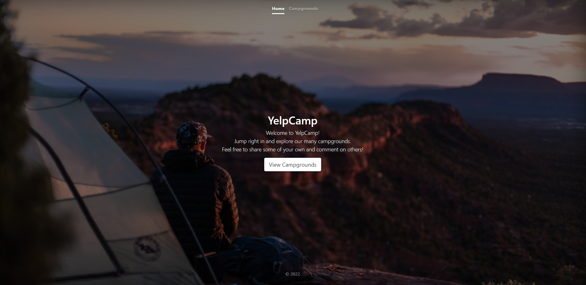

# YelpCamp

YelpCamp is a website where users can create and review campgrounds. In order to review or create a campground, you must have an account. This project was part of Colt Steele's web dev course on udemy.

## Current Features
<li>Withou logging in, users can only browse campgrounds</li>
<li>Users can interact with the map</li>
<li>After logging in, users can create, edit, and remove campgrounds</li>
<li>Users can review campgrounds or remove their reviews</li>


## To Run Locally
1. Have [Node.js](https://nodejs.org/en/download/) and [MongoDB](https://www.mongodb.com/try/download/community) installed on your laptop
2. Load data into MongoDB(yelp-camp)
```
node seeds/index.js
```

3. Run the app
```
node app.js
```
then go to http://localhost:3000
